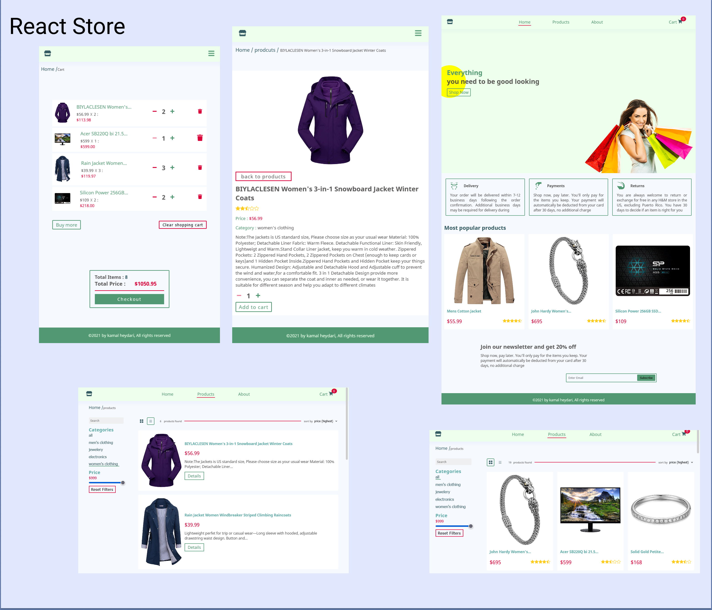

# React Redux e-commerce With Fake Store Api

## Features:
Search, filter, and sort functions
- Enables users to easily find and sort products based on their preferences.

Simple website structure
- Consists of a home page, products page, single product page, about page, and a shopping cart.

Using suspense for optimization

## Demo
See demo on github pages
[React Redux Fake Store](https://kamalheydari.github.io/react-redux-fake-store/)

## Using

- react
- Redux
- Redux-thunk
- Immer
- Redux-persist
- styled-components
- [FakeStoreApi](https://fakestoreapi.com/)
